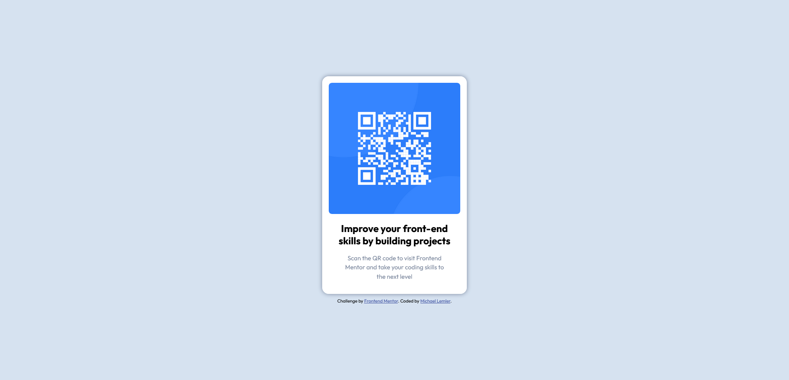

# Frontend Mentor - QR code component solution

This is a solution to the [QR code component challenge on Frontend Mentor](https://www.frontendmentor.io/challenges/qr-code-component-iux_sIO_H). Frontend Mentor challenges help you improve your coding skills by building realistic projects. 

## Table of contents

- [Overview](#overview)
  - [Screenshot](#screenshot)
  - [Links](#links)
- [My process](#my-process)
  - [Built with](#built-with)
  - [What I learned](#what-i-learned)
  - [Useful resources](#useful-resources)
- [Author](#author)

**Note: Delete this note and update the table of contents based on what sections you keep.**

## Overview

### Screenshot

### Links

- Solution URL: [https://github.com/mlemler/qr-code-component](https://github.com/mlemler/qr-code-component)
- Live Site URL: [https://mlemler.github.io/qr-code-component/](https://mlemler.github.io/qr-code-component/)

## My process

### Built with

- Semantic HTML5 markup
- Flexbox
- [Google Webfonts Helper](https://google-webfonts-helper.herokuapp.com/fonts) - Helps self hosting Google Webfonts

### What I learned

I learned how easy it is to host a project like this as [GitHub Page](https://docs.github.com/en/pages/quickstart).

### Useful resources

- [CSS Tricks - A Guide to Flexbox](https://css-tricks.com/snippets/css/a-guide-to-flexbox/) - A great cheat sheet to remember all the Flexbox stuff

## Author

- Website - [mlemler.de](https://mlemler.de)
- Frontend Mentor - [@mlemler](https://www.frontendmentor.io/profile/mlemler)
- Twitter - [@michael_lemler](https://twitter.com/michael_lemler)
